# 🎨 UI Components Monorepo

> A production-ready design system and component library built with Next.js 15, TypeScript, and shadcn/ui. Designed for rapid prototyping and consistent UI/UX across all Agency5 projects.

[](https://nextjs.org/)
[](https://www.typescriptlang.org/)
[](https://tailwindcss.com/)
[](https://ui.shadcn.com/)

## 📋 Table of Contents

- [Overview](#-overview)
- [Architecture](#-architecture)
- [Getting Started](#-getting-started)
- [For Product Managers](#-for-product-managers)
- [For Designers](#-for-designers)
- [For Developers](#-for-developers)
- [Component Catalog](#-component-catalog)
- [Workflow](#-workflow)
- [Contributing](#-contributing)
- [Tech Stack](#%EF%B8%8F-tech-stack)
- [Support](#-support)

## 🌟 Overview

This monorepo provides a **two-layer component system** that enables designers, product managers, and developers to work efficiently with a shared design language:

| Layer | Location | Purpose | Access |
|-------|----------|---------|--------|
| **🎨 UI Layer** | `components/ui/` | shadcn/ui components (modified as needed) | Read-only for PMs/Devs |
| **✨ Custom Layer** | `components/custom/` | Custom components built to shadcn standards | Read-only for PMs/Devs |

**Key Benefits:**
- ✅ Single source of truth for UI components
- ✅ Automatic updates across all projects
- ✅ Designer-developer collaboration workflow
- ✅ Type-safe, accessible components out of the box
- ✅ All components follow shadcn/ui standards and conventions
- ✅ Rapid prototyping with production-ready code

## 🏗️ Architecture

```
ui-components-monorepo/
├── app/                    # Next.js 15 App Router
├── components/
│   ├── ui/                # shadcn/ui components (modified)
│   │   ├── button.tsx
│   │   ├── card.tsx
│   │   ├── input.tsx
│   │   └── label.tsx
│   └── custom/            # Custom components (shadcn standards)
│       ├── [your-component].tsx
│       └── [your-component].tsx
├── lib/                   # Utility functions
├── public/                # Static assets
├── components.json        # shadcn/ui configuration
└── package.json
```

**Note:** Both `components/ui/` and `components/custom/` are flat directories with no subdirectories. All component files are at the top level of their respective folders.

### Component Layers Explained

**`components/ui/`** - Modified shadcn/ui Components
- Base components from shadcn/ui
- Can be customized/modified as needed
- Maintained by developers
- Follow shadcn/ui patterns and conventions
- Flat structure: all `.tsx` files in root of `ui/`

**`components/custom/`** - Custom Components
- Built from scratch following shadcn/ui standards
- Use same patterns as shadcn/ui (Radix UI + Tailwind)
- Designed for Agency5-specific use cases
- Maintain consistency with ui/ layer
- Flat structure: all `.tsx` files in root of `custom/`

## 🚀 Getting Started

### Prerequisites

- Node.js 18+ and npm
- Git
- Code editor (VS Code recommended)

### Installation

```bash
# Clone the repository
git clone https://github.com/agency5/ui-components-monorepo.git

# Navigate to the directory
cd ui-components-monorepo

# Install dependencies
npm install

# Run development server
npm run dev
```

Visit `http://localhost:3000` to see the component showcase.

## 👔 For Product Managers

**→ Read the full guide:** [GETTING-STARTED-FOR-PMs.md](./GETTING-STARTED-FOR-PMs.md)

### Quick Start for PMs

1. Clone this repo to your local machine
2. Import components into your prototypes:
   ```tsx
   import { Button } from '@/components/ui/button'
   import { Card } from '@/components/custom/card'
   ```
3. Pull latest updates weekly: `git pull origin master`

**You have read-only access** - use components but don't modify them.

## 🎨 For Designers

**→ Read the full guide:** [components/custom/README.md](./components/custom/README.md)

### Design-to-Code Workflow

1. **Design in Figma** using the Agency5 design system
2. **Build component** following shadcn/ui patterns:
   - Use Radix UI primitives for accessibility
   - Style with Tailwind CSS utility classes
   - Follow existing component structure from `ui/` layer
3. **Create a branch:** `git checkout -b design/new-component`
4. **Add to** `components/custom/`
5. **Submit Pull Request** for review
6. **Merge to master** after approval

Your components become instantly available to the whole team!

## 👨‍💻 For Developers

### Importing Components

**Option A: Direct Import (within this monorepo)**
```typescript
import { Button } from '@/components/ui/button'
import { Card, CardContent, CardHeader } from '@/components/ui/card'
```

**Option B: Copy to External Project**
```bash
# Copy a specific component
cp components/ui/button.tsx ../my-project/components/

# Or copy the entire directory
cp -r components/ui ../my-project/components/
```

### Staying Updated

```bash
# Pull latest component updates
git pull origin master

# Check what changed
git log --oneline -10
```

### Adding shadcn/ui Components

**Repository maintainers only:**

```bash
# Add a new shadcn/ui component
npx shadcn@latest add dialog

# Component will be added to components/ui/
```

## 📦 Component Catalog

### UI Components (shadcn/ui)

Located in `components/ui/` - **Modified shadcn/ui components**

| Component | Status | Description |
|-----------|--------|-------------|
| Button | ✅ Available | Primary, secondary, outline variants |
| Card | ✅ Available | Content container with header/footer |
| Input | ✅ Available | Form input with label support |
| Label | ✅ Available | Accessible form labels |
| _More coming_ | 🚧 Planned | Dialog, Select, Toast, etc. |

### Custom Components

Located in `components/custom/` - **Custom components built to shadcn standards**

| Component | Status | Description |
|-----------|--------|-------------|
| _Coming soon_ | 🚧 Planned | Custom components following shadcn/ui patterns |

**Want a new component?** Contact the design team or create a GitHub issue.

## 🔄 Workflow

```mermaid
graph LR
    A[Designer in Figma] --> B[Build Component]
    B --> C[Follow shadcn/ui Standards]
    C --> D[Create design/* branch]
    D --> E[Add to components/custom/]
    E --> F[Submit Pull Request]
    F --> G[Code Review]
    G --> H[Merge to master]
    H --> I[PMs & Devs pull updates]
    I --> J[Use in projects]
```



### Component Standards

All components in `custom/` must follow shadcn/ui conventions:
- ✅ Built with Radix UI primitives for accessibility
- ✅ Styled using Tailwind CSS utility classes
- ✅ TypeScript with proper type definitions
- ✅ Composable API similar to shadcn/ui components
- ✅ Support for className prop forwarding
- ✅ Accessible by default (ARIA attributes, keyboard navigation)

### Branch Protection Rules

- ✅ **master:** Protected - requires PR approval
- ✅ **design/*:** Designers have write access
- ✅ All other users: Read-only (clone & pull)

## 🤝 Contributing

### ✅ DO

- Import and use components in your projects
- Pull updates regularly (`git pull`)
- Report bugs via GitHub Issues
- Request new components via Issues or Slack

### ❌ DON'T

- Modify files in `components/ui/` or `components/custom/` directly
- Push directly to master (use pull requests)
- Create custom variants of existing components
- Commit `node_modules/` or build artifacts

### Reporting Issues

Found a bug? [Create an issue](https://github.com/agency5/ui-components-monorepo/issues/new) with:
- Component name
- Expected vs actual behavior
- Steps to reproduce
- Screenshots (if applicable)

## 🛠️ Tech Stack

| Technology | Version | Purpose |
|------------|---------|---------|
| **Next.js** | 15.x | React framework with App Router |
| **React** | 19.x | UI library |
| **TypeScript** | 5.x | Type safety |
| **Tailwind CSS** | 4.x | Utility-first styling |
| **shadcn/ui** | Latest | Accessible component primitives |
| **Radix UI** | Latest | Headless UI components |
| **ESLint** | Latest | Code linting |

### Key Dependencies

```json
{
  "next": "^15.0.0",
  "react": "^19.0.0",
  "typescript": "^5.0.0",
  "tailwindcss": "^4.0.0",
  "@radix-ui/react-*": "latest"
}
```

## 📞 Support

| Question | Contact |
|----------|---------|
| Need a new component? | Design team or create GitHub Issue |
| Found a bug? | [Create an issue](https://github.com/agency5/ui-components-monorepo/issues) |
| General questions? | Team Slack #design-system |
| Access issues? | Repository admin |

## 📄 License

Internal use only - Agency5 proprietary.

## 🔐 Repository Access

| Role | Access Level | Permissions |
|------|--------------|-------------|
| Product Managers | Read-only | Clone, pull |
| Developers | Read-only | Clone, pull |
| Designers | Write (design/* branches) | Create branches, submit PRs |
| Admins | Full access | Merge to master, manage settings |

---

**Made with ❤️ by Agency5**
